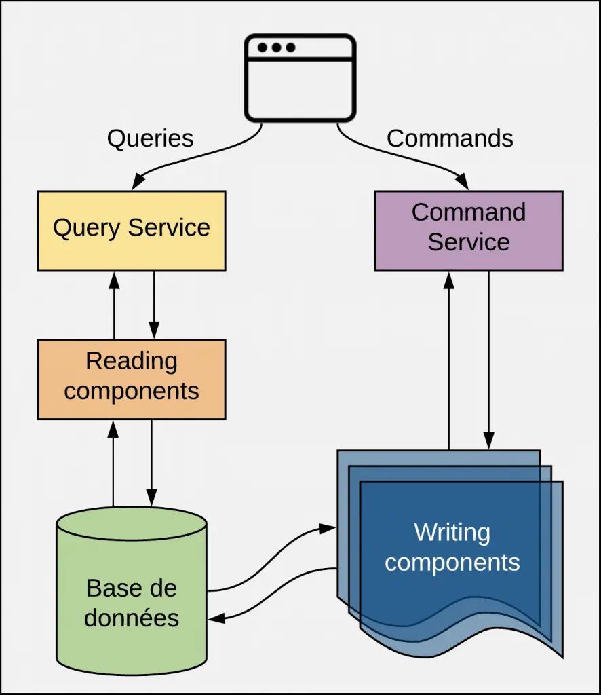
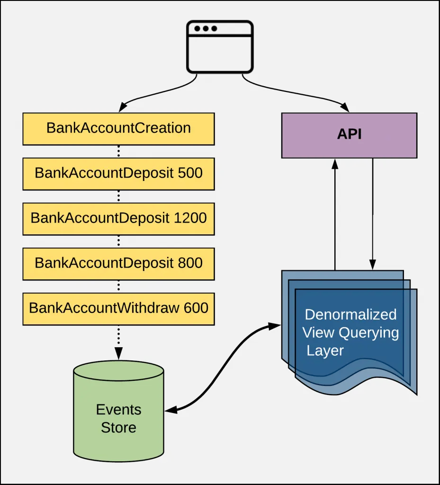
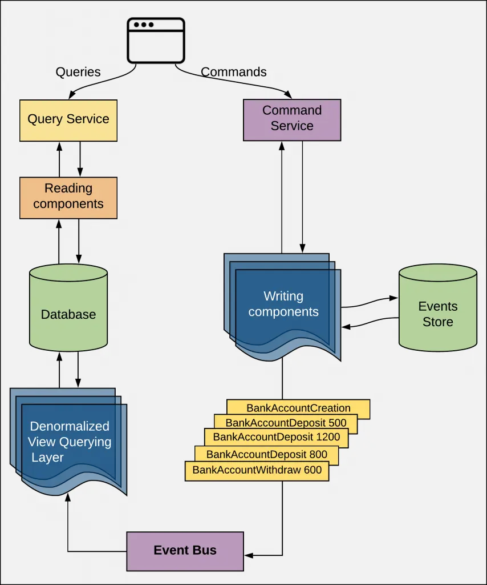
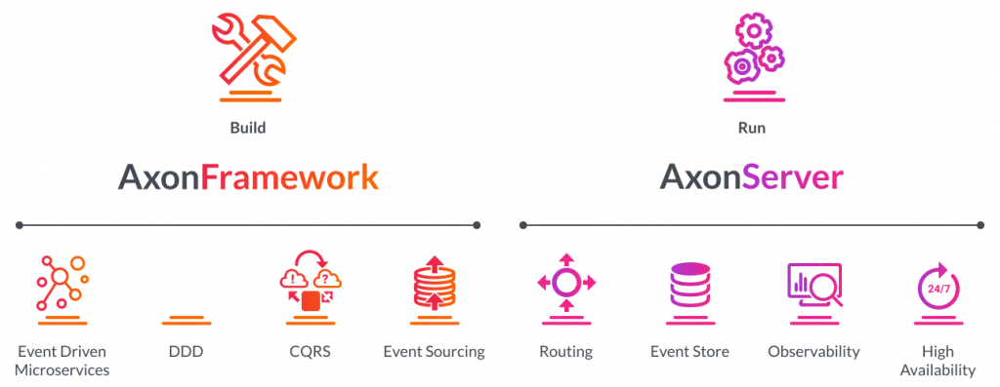

# CQRS and Event Sourcing in Spring Boot and Axon

**CQRS** stands for **Command Query Responsibility Segregation** is a design pattern that aims to **separate** the **Read** and **Write** operations. 
In the CQRS distinguishes the operations as:

* **Queries**: a Read only operation - no state is updated after executing queries
* **Commands**: a Writing operation - state is updated after executing commands
  

* A **Query** is a **Read operation**, that **does not update any the state** of the application. 
* A **Query** is handled by the **Reading Components** that will interact with the **DB**, parses the **DB response**, creates a **Data Transfert Object** that will be returned to the User.

* A **Command** is a **Business Action** that the Application’s user want to do, for example: RegisterStudent, MakeDeposit, etc..
* Every **Command** has a **Handling Layer** that knows how to apply the **Business Action**. 
* Generally, commands are inserted in a **Queue** to be processed **asynchronously**, so technically speaking, a **Command Handler** is invoked by a **Queue Listener**...

# What is the Event Sourcing Pattern ?

* Event Sourcing aims to persist the state of a business entity as a sequence of state-changing events. 
* Every action performed on a business entity should be persisted. The application reconstructs an entity’s current state by replaying the events.
* To reconstruct the current state of a business entity, we need to replay all the events occurred on this business entity. It means we do not store the state of the business entity.
* Applications persist events in a database of events called **event store**. The store has an API for adding and retrieving an entity’s events. 
  The **event store** also behaves like a message broker. It provides an API that enables services to subscribe to events. When a service saves an event in the event store, it is delivered to all interested subscribers.
* In order to optimize loading, an application can periodically save a **snapshot** of an entity’s current state. 
  To reconstruct the current state, the application finds the most recent **snapshot** and the events that have occurred since that snapshot. As a result, there are fewer events to replay.

# Why we are always coupling these patterns ?

* **CQRS** separates the responsibilities, typically into different components. The first component covers **CUD operations** (without the Reading), while a second component will ensure the **Read operation**.
* **Event Sourcing** will ensure consistency, storing a record for every action in a dedicated database.
* From there, an **event handler** reads these changes in order, applies them appropriately and marks them as complete once the transaction is complete. 
  This **event handler** does not need to be complex – it can be as simple as an *API endpoint*. Once the **event handler** creates an event record, a central service messaging system can push notifications every time it discovers about a new event.

# Axon framework

**CQRS** and **Event Sourcing** patterns can be implemented using Axon.

* **Axon** provides a unified, productive way of developing Java applications that can evolve without significant refactoring from a monolith to Event-Driven microservices. 
* **Axon** includes both a programming model as well as specialized infrastructure to provide enterprise ready operational support for the programming model - especially for scaling and distributing mission critical business applications. 
* The programming model is provided by the popular **Axon Framework** while **Axon Server** is the infrastructure part of **Axon**, all open sourced.

