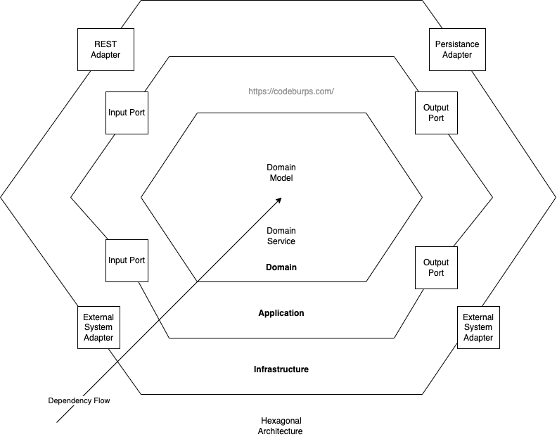

# Core Concepts

1. Core Doman (Center of the Hexagon)
   The heart of the application that contains all the **business rules and logic**. This domain layer should be
   independent of any external frameworks, databases, UI, or external services. It's purely focused on the problem
   domain.

2. **Ports (Interfaces)**
   These are **interfaces** that define the interactions between the core domain and the outside world. Ports allow
   the domain to be decoupled from specific implementations. Ports can be classified as:

   2.1. **Inbound Ports**: **Interfaces** that **define the ways external systems (ex.: UI, REST controllers) can interact
        with the domain**. These can be use case-driven interfaces.

   2.2. **Outbound Ports**: **Interfaces** that define **how the domain interacts with external systems (ex.: databases,
        messaging services, other APIs)**.

3. **Adapters**
   These are the **actual implementations of the Ports**. Adapters adapt the external systems to the core domain
   by implementing the Port interfaces.

   3.1. **Inbound Adapters**: REST controllers, CLI commands, or other entry points that implement inbound ports.
   
   3.2. **Outbound Adapters**: Repositories, REST clients, messaging implementations, etc, that implement outbound ports.

# The core definition of "Input" vs "Output"

In Hexagonal Architecture, the terms "Input" and "Output" are defined based on the perspective of the core domain:

**Term**           | **Functionality**
-------------------|-------------------
Input (Driving)    | Anything that **starts a use case** or **drives the core logic**.
Output (Driven)    | Anything that the application core **calls upon** to store data, or send notifications after a use case is finished.       
